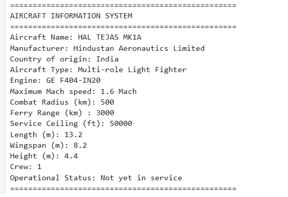

# ✈️ Aircraft Information System

## 📖 Project Overview

The Aircraft Information System is a beginner-friendly Python project developed to store and display the technical specifications of the **HAL Tejas Mk1A**. This project was created while learning the fundamentals of Python programming and demonstrates the use of variables, data types, and the `print()` function in an Aeronautical Engineering application.

---

## 🚀 Features

- Displays technical specifications of the HAL Tejas Mk1A
- Uses Python variables to store aircraft data
- Demonstrates different Python data types
- Displays formatted output using the `print()` function
- Beginner-friendly and easy to understand

---

## 🛠 Technologies Used

- Python
- Jupyter Notebook
- GitHub

---

## 📂 Project Structure

```
Aircraft-Information-System/
│
├── LICENSE
├── README.md
├── aircraft_information_system.ipynb
└── output.png
```

---

## 📸 Project Output



---

## 🔮 Future Improvements

- User Input
- Aircraft Comparison
- Multiple Aircraft Database
- File Handling
- Graphical User Interface (GUI)
- AI Integration

---

## 👨‍💻 Developer

**Durugu Gokul Varma**

Bachelor of Engineering (Aeronautical Engineering)

